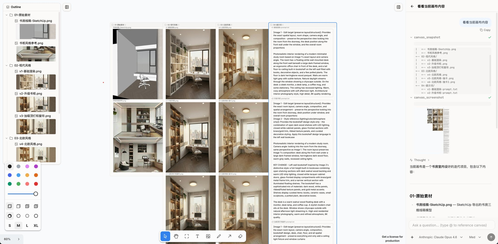

# Canvas Cowork

Give Claude Cowork a canvas UI

[English](README.md) | [中文](README.zh-CN.md)


A spatial canvas interface where humans and AI agents collaborate through a shared workspace. The canvas is abstracted as a file system -- users interact visually on the canvas, while agents read and write files.



## How It Works

### Canvas FS

Every canvas element maps bidirectionally to a file or directory:

| Canvas Element | File System | Description |
|----------------|-------------|-------------|
| Text | `name.txt` | Text content as file content |
| Image | `name.png` | Image file with optional annotation overlay |
| Frame | `name/` | Directory that groups elements |
| Arrow | Connection metadata | Semantic link between elements |

When a user drags an image into a frame on the canvas, the agent sees a file moved into a directory. When the agent writes a new file, it appears on the canvas automatically. The sync layer handles deduplication, rename detection, and image refresh to keep both sides consistent.

### Annotated Images

When an image has arrows or drawings on it, the agent receives two views: the **original image** and an **annotated image** (screenshot with all markups visible), enabling precise visual feedback.

### Agent Tools

- **`canvas_snapshot`** - Semantic snapshot of the canvas as a directory tree with arrow connections
- **`canvas_screenshot`** - Full canvas screenshot for visual context
- **`generate_image`** - AI image generation and editing with multi-image references (style_reference, content_reference, edit_target), supports subdirectory output paths
- Standard file operations (read, write, edit, bash) scoped to the canvas directory

### Outline Panel

A file-tree sidebar that mirrors the canvas structure. Frames display as collapsible folders, text and images as leaves (with thumbnail previews for images). Clicking a node selects and zooms to the corresponding shape on the canvas.

### Paste Images

Images can be pasted or picked from files directly into the canvas. They are automatically compressed server-side (via sharp) before being sent to the model.

### Prompt File Auto-Save

User messages longer than 200 characters are automatically saved as text files in the canvas directory, preserving full prompt content and enabling the agent to reference them later.

### Canvas Organization

The agent proactively organizes the canvas by creating frames to group related elements, following naming conventions that match the user's language.

### Chat with Context

The chat input supports `@` mentions to reference canvas elements and attaching the current canvas selection as context for the agent.

## Tech Stack

- **Runtime**: [Bun](https://bun.sh)
- **Canvas**: [tldraw](https://tldraw.dev) v4
- **Frontend**: React 19, Tailwind CSS v4, shadcn/ui
- **Build**: Vite
- **Image Processing**: [sharp](https://sharp.pixelplumbing.com) for server-side compression
- **Agent**: Anthropic Claude via [pi-coding-agent](https://github.com/badlogic/pi-mono/tree/main/packages/coding-agent)

## Getting Started

```bash
bun install
bun run dev
```

This starts both the Vite dev server (port 5173) and the Bun backend (port 3000).

## Configuration

### LLM

The default model is `anthropic/claude-opus-4.6` via OpenRouter. Set the corresponding API key as an environment variable:

```bash
export OPENROUTER_API_KEY=your-key
```

You can switch models at runtime from the UI. The available models are determined by which API keys are configured. Supported providers and their environment variables:

| Provider | Environment Variable |
|----------|---------------------|
| OpenRouter | `OPENROUTER_API_KEY` |
| Anthropic | `ANTHROPIC_API_KEY` |
| OpenAI | `OPENAI_API_KEY` |
| Google | `GEMINI_API_KEY` |
| Azure OpenAI | `AZURE_OPENAI_API_KEY` |
| xAI | `XAI_API_KEY` |
| Groq | `GROQ_API_KEY` |
| Mistral | `MISTRAL_API_KEY` |

For the full list of providers, see the [pi-mono providers documentation](https://github.com/badlogic/pi-mono/blob/main/packages/coding-agent/docs/providers.md).

### Image Generation

The `generate_image` tool uses Google Gemini's image generation API (`scripts/generate_image.py`). Configure one of the following:

**Option 1: Gemini API Key**

```bash
export GEMINI_API_KEY=your-key
```

**Option 2: Google Vertex AI**

```bash
export GOOGLE_GENAI_USE_VERTEXAI=1
export GOOGLE_CLOUD_PROJECT=your-project-id
export GOOGLE_CLOUD_LOCATION=global
export GOOGLE_APPLICATION_CREDENTIALS=$HOME/.config/google-vertex-ai/credentials.json
```

## Architecture

```
src/
  server/          # Bun HTTP/WebSocket server, agent session management, Canvas FS bridge
  shared/          # WebSocket protocol types
  web/src/
    components/    # React UI (canvas editor, agent panel, chat)
    canvas/        # Bidirectional canvas-filesystem sync logic
    hooks/         # WebSocket connection and agent state management
canvas/            # Canvas FS working directory (agent's workspace)
```

## License

MIT
